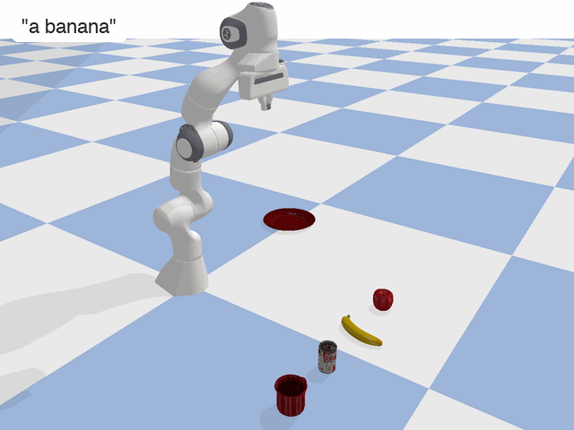

# From CLIP to Grasp

<p align="center">
  
</p>

**Tell a robot arm what to pick up, in plain language.**

From CLIP to Grasp is a simulated pick-and-place demo that connects open-vocabulary text to what a robot sees. A Franka Panda arm looks at a table of household objects through its wrist camera, uses OpenAI's [CLIP](https://github.com/openai/CLIP) to find the object that best matches your description, and places that object on a plate.

## How it works

1. **Scene.** [PyBullet](https://pybullet.org) simulates a Franka Panda arm, four objects from the [YCB dataset](https://www.ycbbenchmarks.com/) (apple, banana, tomato soup can, mug), and a plate as the drop-off target.
2. **Look.** The arm captures an image from a camera mounted on its end effector.
3. **Crop.** Each object's 3D bounding box is projected into that image to cut out one crop per object.
4. **Match.** CLIP (ViT-B/32) embeds every crop and your query, phrased as "a photo of *query*". The crop with the highest cosine similarity is the target. If no crop reaches a minimum similarity, the robot stays put.
5. **Pick and place.** The arm grasps the target from above at its current position, lifts it, and lowers it onto the plate, moving in straight lines through inverse-kinematics waypoints.

## Quick start

You'll need [conda](https://docs.conda.io/). The environment file was exported on macOS.

```bash
git clone https://github.com/Connor-Mattson/RoboCLIP.git
cd RoboCLIP
conda env create -f environment.yml
conda activate clip-to-grasp
pip install -r requirements.txt
python -m main
```

The first run downloads the CLIP weights (about 350 MB). CLIP runs on Apple's MPS backend when it's available and on the CPU otherwise; no training is involved.

## Running the demo

`python -m main` opens a PyBullet window with the scene. When the terminal shows `Enter a query:`, describe an object:

| Query | What happens |
|---|---|
| `a banana`, `something yellow` | The banana goes on the plate |
| `an apple` | The apple goes on the plate |
| `a soup can` | The soup can goes on the plate |
| `a mug`, `a red mug` | The mug goes on the plate |
| `a giraffe` | `No object matches 'a giraffe' ...`, and the robot doesn't move |

## Recording a GIF

The GIF at the top of this page was made with:

```bash
python -m examples.record_gif "a banana" --out media/clip-to-grasp_banana.gif
```

This runs the same demo without opening a window and renders it from an external camera. Pass any query, and adjust the shot with `--camera TX TY TZ DIST YAW PITCH`, `--size WIDTH HEIGHT`, or `--no-caption`. If the query doesn't match an object, no GIF is written.

## Examples

Each stage of the pipeline also has a standalone script. Run them from the repository root:

| Command | What it shows |
|---|---|
| `python -m examples.panda_ik` | Inverse kinematics and position control: the arm grasps and lifts a small cube |
| `python -m examples.ycb_scene` | Pick-and-place with fixed, hand-tuned grasp heights. Type `apple`, `banana`, `soup`, or `mug` at the prompt; not every object grasps reliably |
| `python -m examples.ee_camera_example` | The end-effector camera image, in a matplotlib window (the arm doesn't move) |
| `python -m examples.object_extraction_example` | Projected bounding boxes on the camera image, then each object crop; saves the crops to `media/cropped_ycb/` |
| `python -m examples.clip_example` | CLIP zero-shot classification of [`media/dog.jpg`](media/dog.jpg) against "a diagram", "a dog", and "a cat" |
| `python -m examples.clip_repr_example` | A text query matched against the saved crops in `media/cropped_ycb/` |
| `python -m examples.record_gif` | A GIF recording of the full demo (see above) |

## Project structure

```
main.py                        End-to-end demo: query → CLIP → pick-and-place
src/sim/simulation.py          PyBullet world wrapper
src/sim/robot.py               Franka Panda control: IK, position control, gripper, end-effector camera
src/sim/model_obj.py           Scene object description (URDF, pose, scale)
src/perception/crop.py         Crops each object from the camera image using its projected bounding box
src/perception/projection.py   Projects 3D world points to image pixels
src/util/capture_camera.py     Prints the PyBullet GUI camera pose, for choosing viewpoints
examples/                      Standalone scripts for each stage
models/ycb/                    YCB object meshes and URDFs
media/                         Demo GIF and example images
```

## Limitations

- **Crops come from the simulator.** Object bounding boxes are read from PyBullet rather than detected, so running on a real robot would need an object detector in front of CLIP.
- **The match cutoff is scene-specific.** `MIN_SIMILARITY` in `main.py` was tuned for this scene and camera. It rejects clearly unrelated queries, but asking for a similar-looking object that isn't there (for example "a hammer") can still pick the closest match.
- **Grasps are simple.** The gripper always approaches from directly above with a fixed orientation. The soup can is scaled slightly below its real size so it fits the Panda's gripper.
- **The layout is fixed.** Object positions are set in `main.py`.

## Acknowledgements

- [@kwonathan](https://github.com/kwonathan) for the [URDFs for the YCB dataset](https://github.com/kwonathan/ycb_urdfs/tree/main).
- OpenAI for releasing the [CLIP](https://github.com/openai/CLIP) weights, which give this project its vision and language capabilities.
- The [PyBullet](https://pybullet.org) team for the simulator and the Franka Panda model.

## License

[MIT](LICENSE) © 2025 Connor Mattson
